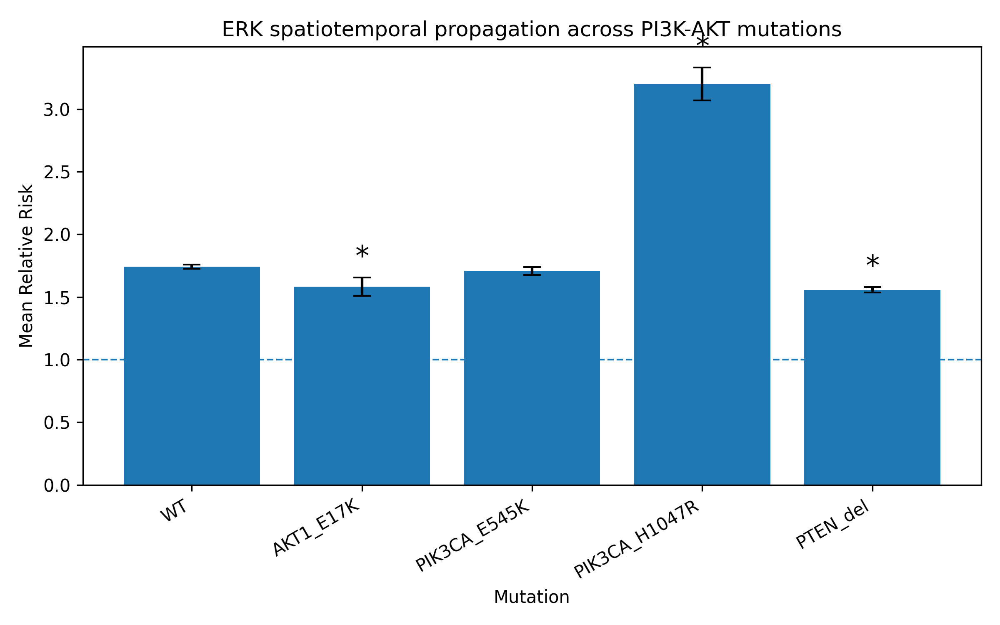
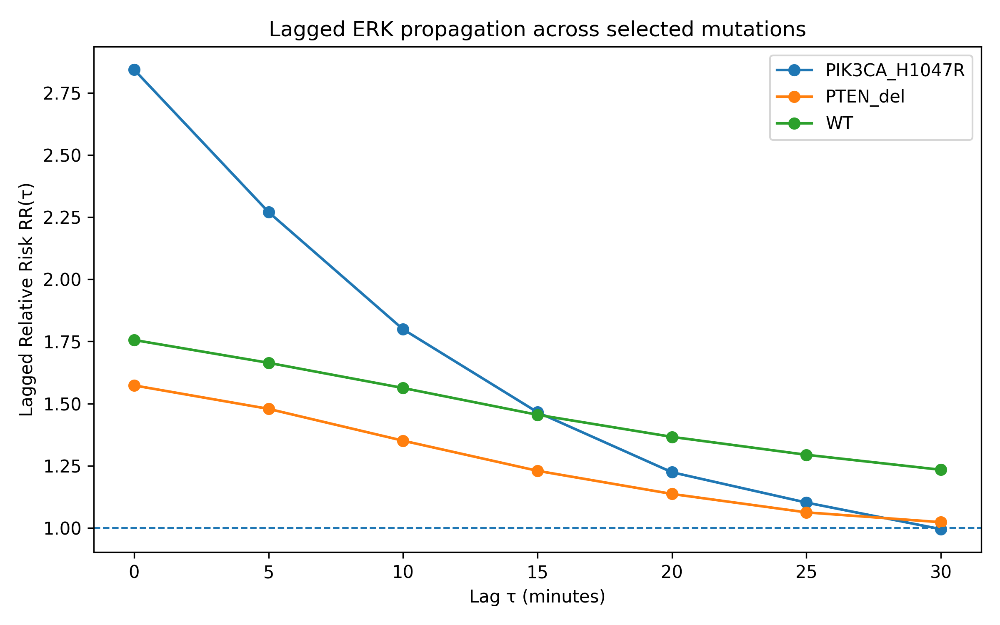

# Spatiotemporal Signal Propagation Project

**Authors:** Aleksandra Burakowska, Mykyta Khrabust 

---

## Part A: Guided Analysis

### Task A1 — Multi-Mutation Spatiotemporal Comparison

#### Research question

Do different PI3K-AKT pathway mutations alter the strength of spatiotemporal ERK signal propagation?
#### Methods

In Task A1, we modified a copy of `compare_spatiotemporal_behavior.py`, saved as `compare_spatiotemporal_behavior_copy.py` to compare ERK spatiotemporal signal propagation across five cell lines: WT, AKT1_E17K, PIK3CA_E545K, PIK3CA_H1047R, and PTEN_del. The analysis used `ERKKTR_ratio` as the signal column, with `spatial_radius = 60`, `future_window_frames = 3`, and `jump_quantile = 0.9`. Mutation was used as the grouping variable, and the final analysis included 120 experiment-site blocks.

For each experiment-site block, the script computed the Relative Risk (RR) of a near-future ERK activity jump given current exposure to active neighbouring cells:

$$
RR = \frac{P(\text{future jump} \mid \text{neighbour exposed})}
{P(\text{future jump} \mid \text{not neighbour exposed})}
$$

The script generated two main summary tables. `block_level_summary.csv` contains one row per experiment-site block, including the mutation, jump threshold, number of cells/nodes, spatial and temporal edge counts, exposed and unexposed jump rates, risk difference, and block-level RR. These block-level RR values were used for statistical testing. `group_level_summary.csv` aggregates the block-level results by mutation and reports summary statistics such as mean and median RR, mean risk difference, exposed and unexposed jump rates, and average edge counts. This file was used to summarize propagation strength across mutations and to generate the comparison plot. The analysis settings and included groups were documented in `task_description.json`.

For each mutation, we computed the mean RR and standard error from block-level RR values:

$$
SE = \frac{s}{\sqrt{n}}
$$

where $$\(s\) is the standard deviation of block-level RR values and \(n\) is the number of analysed blocks.

Each mutant was compared with WT using a two-sided Mann–Whitney U test. We used this test because the comparison involved independent groups of block-level RR values: WT blocks versus blocks from each mutant cell line. The Mann–Whitney U test is non-parametric, so it does not require RR values to follow a normal distribution. In our analysis, the test evaluated whether the distribution of block-level RR values for each mutant differed from the distribution observed in WT.

Since four mutant-vs-WT comparisons were performed, p-values were corrected using the Bonferroni method:

$$
p_{\text{corrected}} = \min(p \cdot 4, 1)
$$

Mutations with corrected \(p < 0.05\) were considered significantly different from WT.
#### Results

The full comparison table was saved as `outputs/mutations_comparison_table.csv`.

All analysed cell lines showed mean Relative Risk values above 1. WT had a mean RR of 1.74. Among the mutants, PIK3CA_H1047R showed the highest mean RR of 3.20 and was significantly different from WT after Bonferroni correction $$(\(p = 1.23 \times 10^{-8}\))$$. PIK3CA_E545K had a mean RR of 1.71 and was not significantly different from WT $$(\(p = 0.73\))$$. AKT1_E17K and PTEN_del showed lower mean RR values than WT, with mean RR values of 1.58 and 1.56, respectively. Both were significantly different from WT after correction..

**Figure 1.** Mean Relative Risk (RR) of ERK spatiotemporal propagation across PI3K-AKT pathway mutations. Bars show the mean block-level RR for each mutation, and error bars show the standard error. The dashed horizontal line marks \(RR = 1\), which corresponds to no neighbour-associated increase in the probability of a future ERK jump. Values above 1 indicate that cells exposed to active neighbouring cells were more likely to show a near-future ERK activity jump. Asterisks indicate mutations that were significantly different from WT after Bonferroni correction.
#### Interpretation

The results indicate that PI3K-AKT pathway mutations alter the strength of neighbour-linked ERK signal propagation, but not in the same direction for all mutants. Since all analysed groups had mean RR values above 1, ERK activity was locally coordinated in every cell line: cells exposed to active neighbours were more likely to show a near-future ERK jump than non-exposed cells.

The strongest effect was observed for PIK3CA_H1047R, which showed a much higher RR than WT and was significantly different after Bonferroni correction. This suggests that PIK3CA_H1047R may enhance local ERK signal propagation. One possible biological explanation is that this mutation strongly activates PI3K signalling and may increase pathway cross-talk or sensitivity to neighbour-derived signals, making ERK activation more coordinated across nearby cells.

In contrast, AKT1_E17K and PTEN_del showed significantly lower RR values than WT. This does not mean that propagation disappeared, because their RR values were still above 1, but it suggests weaker neighbour-associated ERK coordination relative to WT. PIK3CA_E545K behaved similarly to WT and was not significantly different, indicating that not all PI3K-pathway mutations have the same effect on ERK propagation. Overall, these results support the conclusion that different molecular perturbations within the PI3K-AKT pathway can change spatiotemporal ERK dynamics in distinct ways.

---
### Task A2 — Lagged Exposure Analysis Across Mutations

#### Research question

Do different mutations exhibit different spatiotemporal relay timescales?

#### Methods

In Task A2, we analysed lagged neighbour exposure to test whether ERK signal propagation occurs immediately or with a measurable time delay. We used the `nodes.csv.gz` outputs generated by `spatiotemporal_signal_propagation.py` for three selected groups: WT, PIK3CA_H1047R, and PTEN_del. These groups were chosen based on Task A1, where PIK3CA_H1047R showed the strongest ERK propagation and PTEN_del showed one of the weakest propagation effects relative to WT.

For each group, we computed lagged Relative Risk values $$\(RR(\tau)\)$$ for lags from 0 to 6 frames. Since one frame corresponds to 5 minutes, this covered delays from 0 to 30 minutes:

$$
\tau = 0, 5, 10, 15, 20, 25, 30 \text{ minutes}
$$

For each lag, $$\(RR(\tau)\)$$ was calculated as:

$$
RR(\tau) =
\frac{
P(\text{future jump} \mid \text{neighbour exposed at lag } \tau)
}{
P(\text{future jump} \mid \text{not exposed at lag } \tau)
}
$$

The optimal lag was defined as the lag with the maximum Relative Risk:

$$
\tau^* = \arg\max_{\tau} RR(\tau)
$$

The full lagged results were saved in `outputs/lagged_exposure_full_results.csv`, and the optimal-lag summary was saved in `outputs/lagged_exposure_table.csv`.

#### Results

**Figure 2.** Lagged Relative Risk $$\(RR(\tau)\)$$ for WT, PIK3CA_H1047R, and PTEN_del. The dashed horizontal line marks \(RR = 1\), corresponding to no neighbour-associated increase in the probability of a future ERK jump.

| Mutation | Optimal lag \(\tau^*\) | Optimal lag (min) | Maximum RR |
|---|---:|---:|---:|
| WT | 0 | 0 | 1.756 |
| PIK3CA_H1047R | 0 | 0 | 2.843 |
| PTEN_del | 0 | 0 | 1.573 |

**Table 2.** Optimal lag summary for lagged ERK propagation. For all three groups, the maximum $$\(RR(\tau)\)$$ occurred at $$\(\tau = 0\)$$ minutes.

The lagged exposure analysis showed that all three groups had the strongest neighbour-associated ERK propagation at \(\tau = 0\) minutes. PIK3CA_H1047R had the highest initial lagged RR, with \(RR(0) = 2.84\), followed by WT with \(RR(0) = 1.76\), and PTEN_del with \(RR(0) = 1.57\). In all groups, \(RR(\tau)\) decreased as the lag increased from 0 to 30 minutes. By 30 minutes, PIK3CA_H1047R decreased to approximately \(RR = 0.99\), PTEN_del to \(RR = 1.02\), and WT to \(RR = 1.23\).

#### Interpretation

The results suggest that the strongest detectable neighbour-linked ERK propagation occurs at the shortest measured timescale. Since the optimal lag was \(\tau^* = 0\) minutes for WT, PIK3CA_H1047R, and PTEN_del, we did not observe evidence for a delayed propagation peak within the 0–30 minute window. Instead, the effect was strongest when neighbour activity and future self-jump probability were evaluated without an additional lag.

PIK3CA_H1047R showed the strongest early propagation signal, consistent with Task A1, where this mutation had the highest overall RR. However, its RR decreased rapidly with increasing lag, reaching approximately 1 by 30 minutes. This suggests that the neighbour-associated ERK coordination in PIK3CA_H1047R is strong but short-lived. WT showed a more moderate but more persistent signal, remaining above 1 across the full lag range. PTEN_del showed the weakest propagation among the three selected groups and approached 1 by 30 minutes, indicating that the neighbour effect largely disappeared at longer delays.

Overall, the A2 results suggest that the selected mutations differ mainly in propagation strength rather than in the timing of the propagation peak. All three groups had the same optimal lag, but PIK3CA_H1047R showed a much stronger immediate response than WT or PTEN_del.

#### Results

TODO: insert lagged exposure plot and table.

#### Interpretation

TODO.

---

### Task A3 — Parameter Robustness Assessment

#### Research question

How sensitive is the Relative Risk metric to analysis parameter choices?

#### Methods

TODO.

#### Results

TODO: insert robustness plot.

#### Recommendation

TODO.

---

## Part B: Independent Research

### Research question and hypothesis

TODO.

### Methods

TODO.

### Results

TODO.

### Discussion

TODO.

---

## References

TODO.
