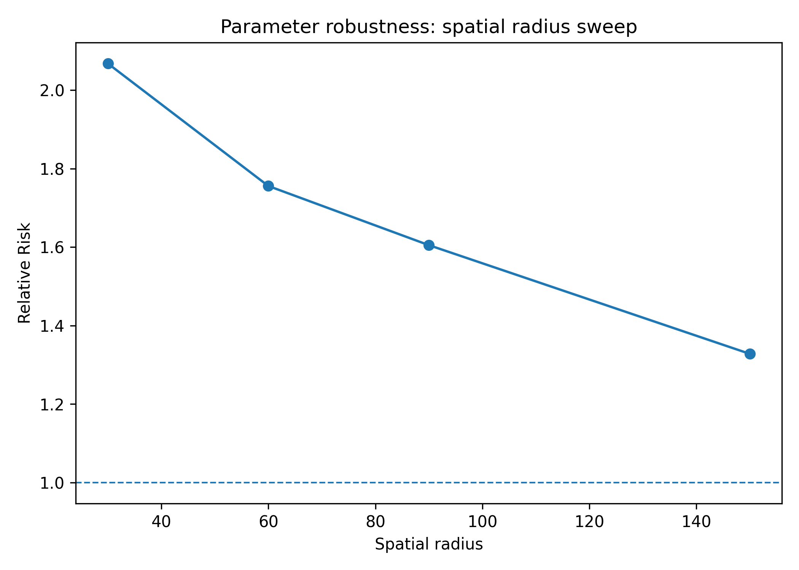
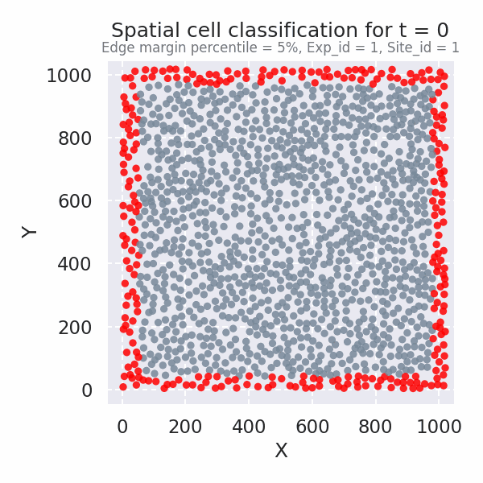
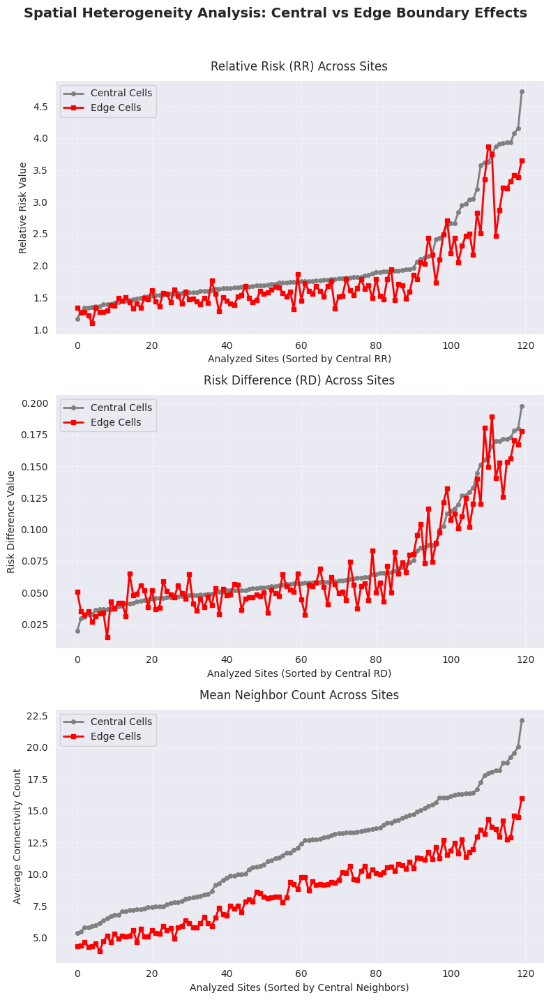

# Spatiotemporal Signal Propagation Project

**Authors:** Aleksandra Burakowska, Mykyta Khrabust 

---

## Part A: Guided Analysis

### Task A1 — Multi-Mutation Spatiotemporal Comparison

#### Research question

Do different PI3K-AKT pathway mutations alter the strength of spatiotemporal ERK signal propagation?
#### Methods

In Task A1, we modified a copy of `compare_spatiotemporal_behavior.py`, saved as `compare_spatiotemporal_behavior_copy.py` to compare ERK spatiotemporal signal propagation across five cell lines: WT, AKT1_E17K, PIK3CA_E545K, PIK3CA_H1047R, and PTEN_del. The analysis used `ERKKTR_ratio` as the signal column, with `spatial_radius = 60`, `future_window_frames = 3`, and `jump_quantile = 0.9`. Mutation was used as the grouping variable, and the final analysis included 120 experiment-site blocks.

For each experiment-site block, the script computed the Relative Risk (RR) of a near-future ERK activity jump given current exposure to active neighbouring cells:

$$
RR = \frac{P(\text{future jump} \mid \text{neighbour exposed})}
{P(\text{future jump} \mid \text{not neighbour exposed})}
$$

The script generated two main summary tables. `block_level_summary.csv` contains one row per experiment-site block, including the mutation, jump threshold, number of cells/nodes, spatial and temporal edge counts, exposed and unexposed jump rates, risk difference, and block-level RR. These block-level RR values were used for statistical testing. `group_level_summary.csv` aggregates the block-level results by mutation and reports summary statistics such as mean and median RR, mean risk difference, exposed and unexposed jump rates, and average edge counts. This file was used to summarize propagation strength across mutations and to generate the comparison plot. The analysis settings and included groups were documented in `task_description.json`.

For each mutation, we computed the mean RR and standard error from block-level RR values:

$$
SE = \frac{s}{\sqrt{n}}
$$

where $s$ is the standard deviation of block-level RR values and $n$ is the number of analysed blocks.

Each mutant was compared with WT using a two-sided Mann–Whitney U test. We used this test because the comparison involved independent groups of block-level RR values: WT blocks versus blocks from each mutant cell line. The Mann–Whitney U test is non-parametric, so it does not require RR values to follow a normal distribution. In our analysis, the test evaluated whether the distribution of block-level RR values for each mutant differed from the distribution observed in WT.

Since four mutant-vs-WT comparisons were performed, p-values were corrected using the Bonferroni method:

$$
p_{\text{corrected}} = \min(p \cdot 4, 1)
$$

Mutations with corrected $p < 0.05$ were considered significantly different from WT.
#### Results

The full comparison table was saved as `outputs/mutations_comparison_table.csv`.

All analysed cell lines showed mean Relative Risk values above 1. WT had a mean RR of 1.74. Among the mutants, PIK3CA_H1047R showed the highest mean RR of 3.20 and was significantly different from WT after Bonferroni correction ($p = 1.23 \times 10^{-8}$). PIK3CA_E545K had a mean RR of 1.71 and was not significantly different from WT ($p = 0.73$). AKT1_E17K and PTEN_del showed lower mean RR values than WT, with mean RR values of 1.58 and 1.56, respectively. Both were significantly different from WT after correction..

**Figure 1.** Mean Relative Risk (RR) of ERK spatiotemporal propagation across PI3K-AKT pathway mutations. Bars show the mean block-level RR for each mutation, and error bars show the standard error. The dashed horizontal line marks \(RR = 1\), which corresponds to no neighbour-associated increase in the probability of a future ERK jump. Values above 1 indicate that cells exposed to active neighbouring cells were more likely to show a near-future ERK activity jump. Asterisks indicate mutations that were significantly different from WT after Bonferroni correction.
#### Interpretation

The results indicate that PI3K-AKT pathway mutations alter the strength of neighbour-linked ERK signal propagation, but not in the same direction for all mutants. Since all analysed groups had mean RR values above 1, ERK activity was locally coordinated in every cell line: cells exposed to active neighbours were more likely to show a near-future ERK jump than non-exposed cells.

The strongest effect was observed for PIK3CA_H1047R, which showed a much higher RR than WT and was significantly different after Bonferroni correction. This suggests that PIK3CA_H1047R may enhance local ERK signal propagation. One possible biological explanation is that this mutation strongly activates PI3K signalling and may increase pathway cross-talk or sensitivity to neighbour-derived signals, making ERK activation more coordinated across nearby cells.

In contrast, AKT1_E17K and PTEN_del showed significantly lower RR values than WT. This does not mean that propagation disappeared, because their RR values were still above 1, but it suggests weaker neighbour-associated ERK coordination relative to WT. PIK3CA_E545K behaved similarly to WT and was not significantly different, indicating that not all PI3K-pathway mutations have the same effect on ERK propagation. Overall, these results support the conclusion that different molecular perturbations within the PI3K-AKT pathway can change spatiotemporal ERK dynamics in distinct ways.

---
### Task A2 — Lagged Exposure Analysis Across Mutations

#### Research question

Do different mutations exhibit different spatiotemporal relay timescales?

#### Methods

In Task A2, we analysed lagged neighbour exposure to test whether ERK signal propagation occurs immediately or with a measurable time delay. We used the `nodes.csv.gz` outputs generated by `spatiotemporal_signal_propagation.py` for three selected groups: WT, PIK3CA_H1047R, and PTEN_del. These groups were chosen based on Task A1, where PIK3CA_H1047R showed the strongest ERK propagation and PTEN_del showed one of the weakest propagation effects relative to WT.

For each group, we computed lagged Relative Risk values $RR(\tau)$ for lags from 0 to 6 frames. Since one frame corresponds to 5 minutes, this covered delays from 0 to 30 minutes:

$$
\tau = 0, 5, 10, 15, 20, 25, 30 \text{ minutes}
$$

For each lag, $RR(\tau)$ was calculated as:

$$
RR(\tau) =
\frac{
P(\text{future jump} \mid \text{neighbour exposed at lag } \tau)
}{
P(\text{future jump} \mid \text{not exposed at lag } \tau)
}
$$

The optimal lag was defined as the lag with the maximum Relative Risk:

$$
\tau^* = \arg\max_{\tau} RR(\tau)
$$

The full lagged results were saved in `outputs/lagged_exposure_full_results.csv`, and the optimal-lag summary was saved in `outputs/lagged_exposure_table.csv`.

#### Results

**Figure 2.** Lagged Relative Risk $RR(\tau)$ for WT, PIK3CA_H1047R, and PTEN_del. The dashed horizontal line marks \(RR = 1\), corresponding to no neighbour-associated increase in the probability of a future ERK jump.

| Mutation | Optimal lag $\tau^*$ | Optimal lag (min) | Maximum RR |
|---|---:|---:|---:|
| WT | 0 | 0 | 1.756 |
| PIK3CA_H1047R | 0 | 0 | 2.843 |
| PTEN_del | 0 | 0 | 1.573 |

**Table 2.** Optimal lag summary for lagged ERK propagation. For all three groups, the maximum $RR(\tau)$ occurred at $\tau = 0$ minutes.

The lagged exposure analysis showed that all three groups had the strongest neighbour-associated ERK propagation at $\tau = 0$ minutes. PIK3CA_H1047R had the highest initial lagged RR, with $RR(0) = 2.84$, followed by WT with $RR(0) = 1.76$, and PTEN_del with $RR(0) = 1.57$. In all groups, $RR(\tau)$ decreased as the lag increased from 0 to 30 minutes. By 30 minutes, PIK3CA_H1047R decreased to approximately \(RR = 0.99\), PTEN_del to \(RR = 1.02\), and WT to \(RR = 1.23\).

#### Interpretation

The results suggest that the strongest detectable neighbour-linked ERK propagation occurs at the shortest measured timescale. Since the optimal lag was $$\(\tau^* = 0\)$$ minutes for WT, PIK3CA_H1047R, and PTEN_del, we did not observe evidence for a delayed propagation peak within the 0–30 minute window. Instead, the effect was strongest when neighbour activity and future self-jump probability were evaluated without an additional lag.

PIK3CA_H1047R showed the strongest early propagation signal, consistent with Task A1, where this mutation had the highest overall RR. However, its RR decreased rapidly with increasing lag, reaching approximately 1 by 30 minutes. This suggests that the neighbour-associated ERK coordination in PIK3CA_H1047R is strong but short-lived. WT showed a more moderate but more persistent signal, remaining above 1 across the full lag range. PTEN_del showed the weakest propagation among the three selected groups and approached 1 by 30 minutes, indicating that the neighbour effect largely disappeared at longer delays.

Overall, the A2 results suggest that the selected mutations differ mainly in propagation strength rather than in the timing of the propagation peak. All three groups had the same optimal lag, but PIK3CA_H1047R showed a much stronger immediate response than WT or PTEN_del.

### Task A3 — Parameter Robustness Assessment

#### Research question

How sensitive is the Relative Risk metric to analysis parameter choices?

#### Methods

In Task A3, we assessed how sensitive the ERK propagation Relative Risk metric was to the choice of spatial neighbourhood radius. The analysis was performed in `notebooks/TaskA3.ipynb`. We used the WT reference block (`exp_id = 1`, `site_id = 1`) and ran `spatiotemporal_signal_propagation.py` multiple times while varying `spatial_radius`.

We tested four spatial radius values:

$$
r = 30, 60, 90, 150
$$

For each value of \(r\), the analysis used `ERKKTR_ratio` as the signal column, with `future_window_frames = 3` and `jump_quantile = 0.9` kept constant. Each run generated a separate sweep folder in `analysis_outputs/`, for example `sweep_r30`, `sweep_r60`, `sweep_r90`, and `sweep_r150`.

For each sweep folder, we extracted the Relative Risk value from: exp_1_site_1_ERKKTR_ratio/summary.json

#### Results

**Figure 3.** Relative Risk as a function of spatial radius for the WT reference block. The dashed horizontal line marks \(RR = 1\), corresponding to no neighbour-associated increase in future ERK jumping. RR decreased as the spatial radius increased, suggesting that the metric is sensitive to how the local neighbourhood is defined.

| Spatial radius | Relative Risk |
|---:|---:|
| 30 | 2.068 |
| 60 | 1.756 |
| 90 | 1.605 |
| 150 | 1.328 |

**Table 3.** Spatial radius sweep results. Relative Risk remained above 1 for all tested values, but decreased with increasing radius.
#### Recommendation

Based on the spatial radius sweep, we recommend using `spatial_radius = 60` for the main analysis. The RR value decreased as the spatial radius increased: $RR = 2.07$ at $r = 30$, $RR = 1.76$ at $r = 60$, $RR = 1.61$ at $r = 90$, and $RR = 1.33$ at $r = 150$. This shows that the metric is sensitive to the neighbourhood definition, but the propagation signal remains above $RR = 1$ across all tested values. Biologically, $r = 30$ may be too restrictive because it captures only very close neighbours, while $r = 150$ likely includes distant cells and weakens the local coordination signal. A radius of 60 provides a balanced choice: it preserves a strong neighbour-associated ERK propagation signal while maintaining a biologically interpretable local neighbourhood.

## TASK B2: Spatial Heterogeneity Analysis

### Research question
Do cells at the edge of the field-of-view may exhibit different propagation
behavior than central cells due to boundary effects or lower neighbor counts.
### Methods

#### Spatial Categorization and Population Truncation
To systematically investigate potential boundary artifacts and analyze
spatial heterogeneity, cells were classified dynamically into Edge and
Central sub-populations. Static coordinate thresholds are insufficient
for long-term live-imaging datasets due to the collective migration,
expansion, or contraction of the cell monolayer over time. To overcome
this limitation, an adaptive, frame-by-frame percentile bounding algorithm
was developed. At each discrete time point ($t$), the spatial distribution
of all tracked cell centroids was independently computed. Boundary margins
were established by calculating the 5th and 95th percentiles for both the $X$ and $Y$ coordinate vectors within that specific frame:

$$X_{\text{low}} = \text{Percentile}(X, 5\%), \quad X_{\text{high}} = \text{Percentile}(X, 95\%)$$
$$Y_{\text{low}} = \text{Percentile}(Y, 5\%), \quad Y_{\text{high}} = \text{Percentile}(Y, 95\%)$$

A single cell-time observation node was categorized as an Edge cell if
its coordinates fell outside this adaptive inner bounding box
($X \le X_{\text{low}}$ or $X \ge X_{\text{high}}$ or
$Y \le Y_{\text{low}}$ or $Y \ge Y_{\text{high}}$). 
Conversely, nodes satisfying all internal constraints were
categorized as Central cells.

**Figure 4.** Animated visualization demonstrating the dynamic spatial
classification of the moving cell layer from site 1 of the first experiment. Red markers indicate
cells captured within the perimeter of the adaptive frame-by-frame percentile boundary (Edge category), while light gray markers indicate the core cell population (Central category).

#### Pipeline Orchestration and Network Connectivity Verification
The batch processing architecture was implemented in the standalone 
executable script `spatial_edge_propagation_analysis.py`. 
To optimize host memory utilization and prevent kernel out-of-memory 
crashes during the ingestion of multi-experiment single-cell datasets, 
data columns were processed sequentially in independent chunks grouped 
by Experiment ID. Within each distinct imaging site, 
a local spatiotemporal network was natively reconstructed by computing 
biosensor ratio deltas, identifying coordinate activation jumps based 
on the 95th quantile threshold, mapping spatial neighbor links within a 
fixed 60 unit radius, and flagging subsequent near-future cell activation
responses within a three-frame window.

Once the networks were established and annotated with the adaptive spatial
boundaries, the local neighbor connectivity was validated. 
Because the scanning radius circle of an edge cell partially
overlaps empty space outside the field of view, boundary constraints
are hypothesized to induce a systematic neighbor deficit. To rigorously
verify this geometric effect on a local level, a non-parametric 
Mann-Whitney U test was performed independently for each individual 
imaging block. This test evaluated the raw shift in the underlying
`neighbor_count` continuous distributions between the Edge and Central
cell node populations.

#### Population-Scale Statistical Inference
Following the localized pipeline extraction, the compiled site-level
metrics from all processed experiment blocks were aggregated into a 
unified summary matrix to evaluate the biological consequences of 
the boundary effect. 
Relative Risk ($RR$) and Risk Difference ($RD$) metrics were calculated 
independently for both spatial zones at each site to quantify the probability
amplification of a kinase activation cascade given a concurrent neighboring
jump event. 

High-level population inference was achieved by applying
a non-parametric Wilcoxon signed-rank test across the paired site vectors (Implemented in the `TaskB2.ipynb` notebook).
This statistical test evaluated the null hypothesis that the distribution 
of Relative Risk remains symmetric and unchanged between the
 central core and boundaries. 
 
### Results

#### Descriptive Summaries and Visual Trends
All 120 independent sites present in dataset were processed
and analyzed. A site-by-site comparison revealed that
the Relative Risk at the boundary exceeded the central core
($RR_{\text{edge}} > RR_{\text{central}}$) in only 19 out of 120
sites (15.8%). Similarly, the Risk Difference at the boundary
was higher than the center ($RD_{\text{edge}} > RD_{\text{central}}$)
in 43 sites (35.8%). Notably, across all 120 analyzed sites, the mean
number of neighbors for cells in the edge category never exceeded the 
neighbor count of the central population, maintaining a steady average
deficit of approximately 2 neighbors per cell near the field-of-view 
boundaries. 
These consistent discrepancies between the spatial zones are clearly visible across all three subplots.

**Figure 5.** Multi-panel visualization comparing central and edge cell
populations across all 120 imaging sites, with independent subplots sorted
by their respective ascending central values. Panels display the site-level
values for (A) Relative Risk ($RR$) central versus edge trends,
(B) Risk Difference ($RD$) central versus edge trends, and (C)
Mean neighbor counts highlighting the persistent gap between
central and edge connectivity.

#### Localized Neighborhood Connectivity Analysis
To statistically validate the physical neighbor deficit observed at
the boundaries, independent Mann-Whitney U tests were performed
on the neighbor count distributions for each of the 120 sites. 
Every single localized test returned a calculated $p$-value
of $0.0000\text{e}+00$.

#### Population-Scale Propagation Inference
A higher-level statistical inference was conducted using all 120 
paired sites to evaluate the impact of these spatial constraints
on signal propagation. The non-parametric Wilcoxon signed-rank test 
was applied to the matched pairs of $RR_{\text{edge}}$ and
$RR_{\text{central}}$ under the null hypothesis ($H_0$) that both
spatial zones share the same Relative Risk distribution, against 
the alternative hypothesis ($H_1$) that the $RR$ shifts significantly
between the center and the boundary.

The test yielded a Wilcoxon statistic of 546.0 with a calculated $p$-value of $6.6602 \times 10^{-16}$. Because $p < 0.05$, the null hypothesis is rejected, demonstrating a statistically significant difference in signal propagation efficiency between edge and central cell matrices. The population-wide mean Relative Risk was $1.799$ for the edge zone compared to $2.014$ for the central core. These metrics indicate that spatial boundary constraints and their associated neighbor deficits are accompanied by a significant reduction in the likelihood of neighbor-driven signal propagation.

### Discussion and Interpretation

#### Methodological Evaluation of Percentile-Based Classification
The frame-by-frame adaptive classification method demonstrated high
structural validity, as evidenced by the stable and statistically
robust neighbor count deficits consistently observed at the margins.
This approach represents an advancement over static spatial
grids by successfully adapting to the dynamic movement and geometric
changes of the cell monolayer. However, a key limitation of this
percentile-based boundary definition ($5^{\text{th}}$ and $95^{\text{th}}$
percentiles) is its strict dependence on absolute cell density.
In highly confluent imaging fields, a fixed $5\%$ coordinate margin 
can geographically span multiple cell layers. If the physical width
of this boundary zone exceeds the defined $60\,\mu\text{m}$ spatial
neighbor interaction radius, cells located deeper in the
layer -- which maintain complete, central-like local connectivity are
falsely categorized as Edge nodes. To refine this methodology, future iterations 
should implement a dynamic margin calculated as a functional
derivative of local cell density and total occupied surface area,
maintaining a constant boundary width relative to the interaction radius.

#### Graph Constraints and Signal Propagation Deficit
The significant population-wide reduction in Relative Risk
($RR_{\text{edge}} = 1.799$ vs $RR_{\text{central}} = 2.014$) 
mathematically validates that cells captured at the field-of-view 
 periphery exhibit diminished coordination with their microenvironment.
This phenomenon is primarily a consequence of spatial graph truncation 
imposed by the physical limits of the microscope sensor. While these cells
likely reside within a continuous, unperturbed tissue matrix in vivo, 
the imaging constraint forces a zero-neighbor assumption for all space 
outside the visible frame. Because the algorithm cannot account for 
unobserved signaling events occurring just beyond the FOV, the true 
upstream exposure of peripheral cells is systematically underestimated.
This missing data artificially deflates the conditional probability 
of neighbor-driven activation, directly lowering the calculated $RR$.
Consequently, to ensure absolute accuracy in downstream spatiotemporal 
analyses, cells falling within this boundary zone should be excluded 
from acting as target nodes, serving strictly as edge-smoothing padding
to protect the integrity of core transmission metrics.

#### Network Topology and Signal Percolation Dynamics
Beyond purely geometric imaging artifacts, the observed propagation
drop can be explained through the lens of network topology and
percolation theory. Intercellular signaling cascades, such as 
ERK activation waves, rely heavily on path redundancy within
the cellular network. In the central core of the monolayer,
the high node degree (average connectivity) provides multiple 
alternative spatial routes for a signal to propagate.
If a specific neighboring cell is transiently non-responsive 
or in a refractory state, the signaling front can simply bypass
it via adjacent nodes, sustaining the wave. At the truncated 
boundary, this topological redundancy is lost. The edge represents
a low-degree peripheral network where signal transmission transitions
from a multi-directional wave into a strict linear chain. In such
constrained configurations, any localized failure of a single node
to transmit the kinase signal acts as a hard bottleneck, prematurely 
terminating the propagation cascade. This loss of alternative routing 
pathways fundamentally drives the lower collective efficiency
of signal transmission near spatial boundaries.